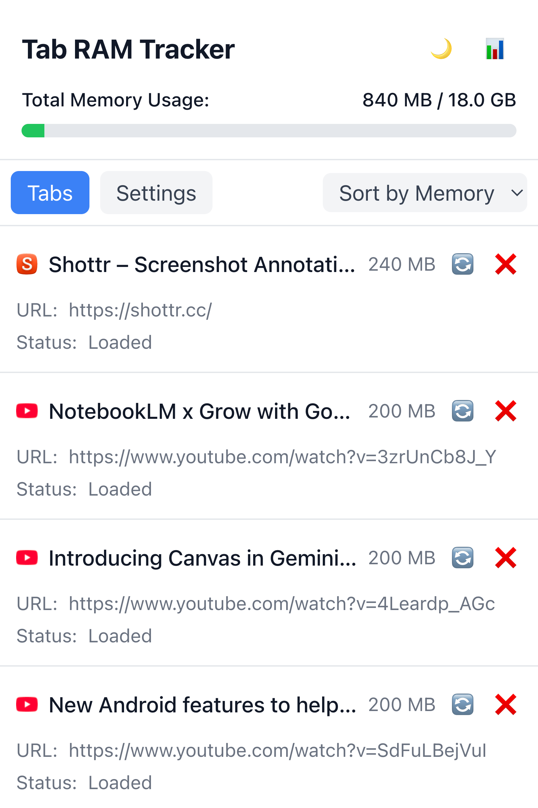
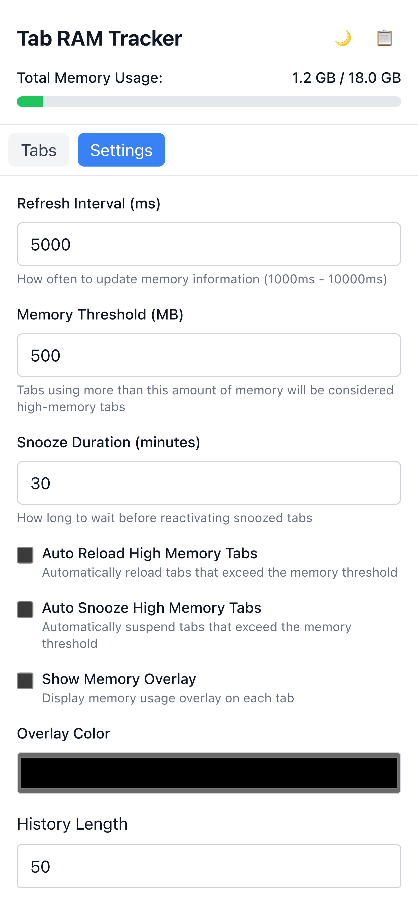

# Tab RAM Tracker - Chrome Extension

A Chrome extension that helps you monitor and manage memory usage of your browser tabs.

## Features

- Track memory usage of individual tabs
- Display memory usage in a user-friendly interface
- Auto-reload high memory tabs (configurable)
- Dark mode support
- Detailed view with memory history charts
- Memory usage overlay on tab icons
- Configurable memory thresholds and refresh intervals

## Screenshots

Here's how the extension looks in action:

### Theme Support

Clean and modern light theme interface.

Comfortable dark theme for low-light environments.

### Settings

Configure your preferences including memory thresholds, auto-reload settings, display options, and theme selection.

## Development

This project uses:

- React + TypeScript + Vite
- Chart.js for memory usage visualization
- Chrome Extension Manifest V3

### Setup

1. Clone the repository
2. Install dependencies: `npm install`
3. Build the extension: `npm run build`
4. Load the extension in Chrome:
   - Open Chrome and navigate to `chrome://extensions/`
   - Enable "Developer mode"
   - Click "Load unpacked" and select the `dist` directory

### Development Commands

- `npm run dev` - Start development server
- `npm run build` - Build the extension
- `npm run test` - Run tests
- `npm run lint` - Run linter

## Configuration

Users can configure:

- Memory threshold for high memory alerts
- Auto-reload settings
- Dark/Light mode
- Refresh interval
- History length for memory tracking
- Overlay appearance

## License

MIT License
